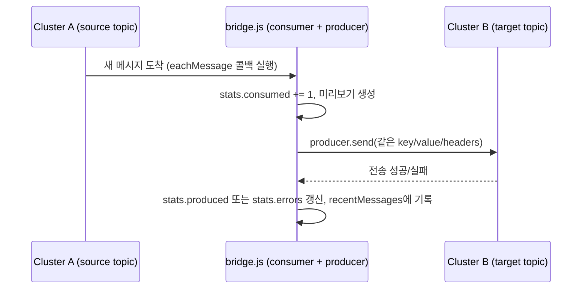
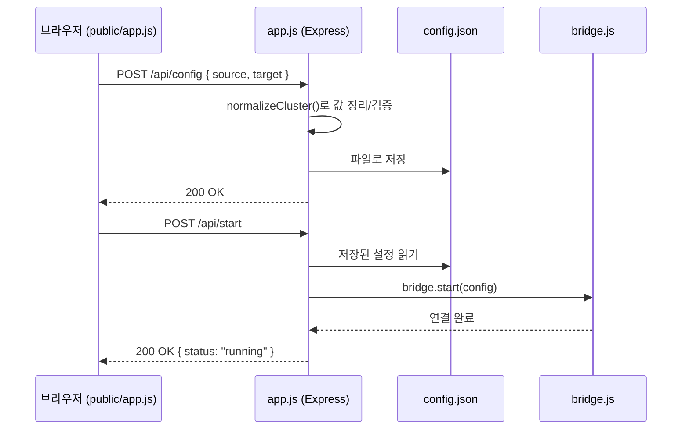

# 코드 설명 문서

Node.js를 잘 몰라도 이 프로젝트 코드를 읽을 수 있도록, 필요한 개념부터 파일 하나하나까지 설명한다.

## 목차

1. [먼저 알아야 할 Node.js/JS 개념](#1-먼저-알아야-할-nodejsjs-개념)
2. [프로젝트 구조](#2-프로젝트-구조)
3. [파일별 상세 설명](#3-파일별-상세-설명)
4. [전체 동작 흐름](#4-전체-동작-흐름)
5. [자주 헷갈리는 부분 Q&A](#5-자주-헷갈리는-부분-qa)

---

## 1. 먼저 알아야 할 Node.js/JS 개념

### Node.js가 뭔가

브라우저 밖에서 자바스크립트를 실행하게 해주는 런타임. 이 프로젝트에서는 웹서버(Express)와 카프카 클라이언트(kafkajs)를 자바스크립트로 돌리는 데 쓴다.

### `package.json` / `npm` / `node_modules`

- **`package.json`**: 이 프로젝트의 이름, 실행 스크립트(`npm start` 등), 필요한 외부 라이브러리 목록을 적어둔 설정 파일. Java의 `pom.xml`, Python의 `requirements.txt`와 비슷한 역할.
- **`npm install`**: `package.json`에 적힌 라이브러리들을 내려받아 `node_modules/` 폴더에 설치한다. `node_modules/`는 용량이 크고 언제든 재생성 가능해서 git에는 올리지 않는다(`.gitignore` 처리됨).
- **`npm start`**: `package.json`의 `scripts.start`에 적힌 명령(`node server.js`)을 실행한다.

### `require` / `module.exports` — 파일 간 코드 공유

```js
// bridge.js 맨 아래
module.exports = KafkaBridge;

// server.js
const KafkaBridge = require('./bridge');
```

`require('./bridge')`는 `bridge.js` 파일을 불러와서, 그 파일이 `module.exports`에 넣어둔 것(여기서는 `KafkaBridge` 클래스)을 가져오는 것. import/export라고 생각하면 된다.

### 콜백 → Promise → `async`/`await`

카프카 연결, 파일 읽기, HTTP 요청처럼 "시간이 걸리는 작업"은 결과가 나중에 도착한다. 이걸 다루는 문법이 `async`/`await`다.

```js
async function example() {
  await producer.connect(); // 연결이 끝날 때까지 여기서 기다린다(그동안 다른 코드는 안 멈춘다)
  console.log('연결 완료');
}
```

- 함수 앞에 `async`를 붙이면 그 함수는 "결과가 나중에 나오는 값"(Promise)을 반환하는 함수가 된다.
- 그 함수 안에서 `await 어떤작업()`을 쓰면, 그 작업이 끝날 때까지 "이 함수 안에서만" 기다린다. (서버 전체가 멈추는 게 아니라, 그 사이에 다른 요청도 동시에 처리될 수 있다 — 이게 Node.js의 핵심 특징인 "논블로킹".)
- 실패하면 `try { ... } catch (err) { ... }`로 잡는다. 이 프로젝트 곳곳에 있는 `try/catch`가 이 용도.

### `Buffer`

카프카 메시지의 key/value는 문자열이 아니라 **바이트 데이터(`Buffer`)**로 온다. 화면에 보여주려면 `.toString('utf-8')`로 문자열 변환이 필요하다 ([bridge.js](bridge.js)의 `toPreview` 함수가 이 역할).

### `EventEmitter` — "이벤트 발생 → 구독자에게 알림" 패턴

```js
class KafkaBridge extends EventEmitter { ... }

bridge.on('log', (line) => { /* line이 생길 때마다 실행됨 */ });
bridge.emit('log', '뭔가 로그');
```

`KafkaBridge`는 로그가 생길 때마다 `'log'`라는 이벤트를 쏘고(`emit`), 이걸 듣고 있는 쪽(`app.js`)이 받아서 로그 배열에 쌓는다. 라디오 방송(emit)과 청취자(on) 관계라고 보면 된다.

### Express — 웹서버 프레임워크

```js
app.get('/api/status', (req, res) => {
  res.json(bridge.getStatus());
});
```

`GET /api/status` 요청이 오면 이 함수가 실행되고, `res.json(...)`으로 JSON 응답을 돌려준다. `req`는 들어온 요청, `res`는 나갈 응답.

---

## 2. 프로젝트 구조

```
kafka-bridge/
├── server.js          # 진입점: 실제 서버를 켜는 파일 (npm start가 실행하는 파일)
├── app.js             # Express 앱 조립 (API 라우트 전부 여기 있음)
├── bridge.js           # 핵심 로직: A 클러스터 소비 → B 클러스터 전송
├── public/             # 브라우저에서 보는 웹 화면
│   ├── index.html
│   └── app.js           # 웹 화면의 자바스크립트 (버튼 클릭, API 호출 등)
├── config.json          # 저장된 설정 (git에는 안 올라감, 로컬에만 생김)
├── __mocks__/kafkajs.js  # 테스트용 카프카 가짜(mock) 구현
├── test/
│   ├── bridge.test.js    # bridge.js 테스트
│   └── app.test.js       # app.js(API) 테스트
└── continuous-producer.js # 부하 테스트용 스크립트 (테스트 대상 코드 아님)
```

**주의**: `public/app.js`와 최상위 `app.js`는 이름은 같지만 완전히 다른 파일이다.
- `public/app.js` → 브라우저(웹 화면)에서 실행됨
- `app.js` → 서버(Node.js)에서 실행됨

---

## 3. 파일별 상세 설명

### 3.1 `bridge.js` — 핵심 로직

카프카 A 클러스터의 토픽을 구독해서 메시지가 오면 그대로 B 클러스터의 토픽으로 보내는 클래스.

```js
class KafkaBridge extends EventEmitter {
  constructor() {
    super();
    this.status = 'stopped';                                    // 현재 상태
    this.stats = { consumed: 0, produced: 0, errors: 0, startedAt: null }; // 처리 통계
    this.recentMessages = [];                                    // 최근 처리한 메시지 20건
  }
```

`start(config)` 메서드가 하는 일, 순서대로:

1. `config.source`/`config.target`으로 카프카 클라이언트 두 개를 만든다 (`buildKafkaConfig`가 brokers/ssl/sasl 옵션을 kafkajs가 이해하는 형태로 변환).
2. **타겟(B) 쪽에 producer(메시지 보내는 역할)를 연결**한다.
3. **소스(A) 쪽에 consumer(메시지 받는 역할)를 연결**하고 지정한 토픽을 구독한다.
4. `consumer.run({ eachMessage: ... })`로 "메시지가 도착할 때마다 실행할 함수"를 등록한다. 이게 이 프로그램의 심장부:

```js
eachMessage: async ({ topic, partition, message }) => {
  this.stats.consumed += 1;
  try {
    await this.producer.send({
      topic: target.topic,
      messages: [{ key: message.key, value: message.value, headers: message.headers }],
    });
    this.stats.produced += 1;   // 성공
  } catch (err) {
    this.stats.errors += 1;     // 실패 (에러를 기록하고 다음 메시지는 계속 처리)
  }
  this.recordMessage(entry);    // 화면에 보여줄 최근 메시지 목록에 기록
}
```

메시지를 역직렬화(JSON 파싱 등)하지 않고 `key`/`value`/`headers`를 받은 그대로 전달한다 — 이게 어떤 포맷(JSON, Avro, 순수 바이트 등)이든 그대로 통과시킬 수 있는 이유.

`stop()`은 반대로 consumer와 producer의 연결을 끊는다. 이미 끊긴 것(`null`)은 다시 끊으려 하지 않도록 `if (this.consumer)` 체크가 있다.

### 3.2 `app.js` — API 서버 조립

`createApp({ bridge, configPath, staticDir })` 함수 하나가 전부다. 인자로 브릿지 인스턴스와 설정 파일 경로를 받아서 Express 앱을 만들어 반환한다. (이렇게 인자로 받게 만든 이유는 테스트에서 진짜 카프카·진짜 파일 대신 가짜를 주입하기 위해서 — 3.5절 참고.)

라우트(=URL별 처리 함수) 목록:

| 라우트 | 하는 일 |
|---|---|
| `GET /api/config` | 저장된 설정 파일(`config.json`)을 읽어서 반환 |
| `POST /api/config` | 웹 화면에서 입력한 설정을 검증 후 저장 |
| `POST /api/start` | 저장된 설정으로 `bridge.start()` 호출 |
| `POST /api/stop` | `bridge.stop()` 호출 |
| `GET /api/status` | 현재 상태/통계 반환 |
| `GET /api/logs` | 최근 로그 300줄 반환 |
| `GET /api/messages` | 최근 처리 메시지 20건 반환 |

`app.use(express.static(staticDir))`는 `public/` 폴더 안의 `index.html`, `app.js`를 브라우저가 그냥 파일처럼 받아갈 수 있게 해주는 설정.

### 3.3 `server.js` — 진입점

```js
const bridge = new KafkaBridge();
const app = createApp({ bridge, configPath: ..., staticDir: ... });
app.listen(PORT, () => { console.log(...) });
```

진짜 `KafkaBridge`와 진짜 `config.json` 경로로 `app.js`의 `createApp`을 호출하고, 실제로 포트를 열어 서버를 띄운다. `npm start`가 실행하는 파일이 이것.

### 3.4 `public/index.html` + `public/app.js` — 웹 화면

브라우저에서 실행되는 순수 HTML/JS. 특별한 프레임워크(React 등) 없이 `fetch()`로 서버의 `/api/*`를 호출한다.

```js
async function refreshStatus() {
  const res = await fetch('/api/status');
  const data = await res.json();
  // 받아온 데이터로 화면의 상태 배지, 통계 텍스트를 갱신
}
setInterval(refreshStatus, 3000); // 3초마다 반복
```

버튼 클릭(`설정 저장`, `시작`, `중지`) → 해당 API 호출 → 결과를 화면에 반영, 이 패턴의 반복이다.

### 3.5 `__mocks__/kafkajs.js` + `test/*.test.js` — 테스트

진짜 카프카 서버 없이 코드를 검증하기 위해 `kafkajs` 라이브러리를 가짜로 대체한다.

```js
jest.mock('kafkajs'); // 이 줄이 있으면, 테스트 안에서 require('kafkajs')는
                       // 진짜 라이브러리 대신 __mocks__/kafkajs.js를 가져온다
```

가짜 `Kafka` 클래스는 실제로 네트워크에 연결하지 않고, `connect()`/`send()` 등을 호출하면 즉시 "성공했다"는 가짜 Promise를 돌려준다. 테스트에서는 이 가짜 producer/consumer를 붙잡아서:

- `consumer.eachMessage(...)`를 테스트 코드가 직접 호출해서 "메시지가 도착한 상황"을 흉내내고
- `producer.send`가 호출됐는지, 어떤 인자로 호출됐는지 확인한다

`test/app.test.js`는 `supertest`라는 라이브러리로 실제 포트를 열지 않고도 `GET /api/status` 같은 HTTP 요청을 코드로 직접 날려서 응답을 검증한다.

```bash
npm test              # 테스트만 실행
npm run test:coverage # 커버리지(코드가 테스트로 얼마나 검증됐는지) 리포트까지 출력
```

### 3.6 `continuous-producer.js` — 부하 테스트 도구

애플리케이션 코드가 아니라, 소스 클러스터(`localhost:9092`)로 초당 10건씩 랜덤 메시지를 계속 보내주는 개발용 스크립트. `node continuous-producer.js`로 직접 실행.

---

## 4. 전체 동작 흐름

### 메시지가 A에서 B로 가는 흐름



### 웹 화면에서 설정을 바꾸는 흐름



---

## 5. 자주 헷갈리는 부분 Q&A

**Q. `app.js`가 왜 두 개(최상위, `public/` 안)인가요?**
하나는 서버용, 하나는 브라우저용. 서로 참조하지 않는 완전히 별개 파일이다. (혼동을 줄이려면 `public/app.js`를 `public/client.js`로 이름을 바꿔도 되는데, 지금은 그대로 유지 중.)

**Q. `config.json`이 왜 git에 없나요?**
카프카 접속 정보(특히 비밀번호)가 담기기 때문에 `.gitignore`로 제외했다. 서버를 새로 클론한 환경에서는 웹 화면에서 다시 입력하고 "설정 저장"을 눌러야 파일이 생긴다.

**Q. `async function`인데 왜 `await` 없이 쓰는 곳도 있나요?**
`app.post('/api/stop', async (req, res) => { await bridge.stop(); ... })`처럼, 함수 안에서 시간이 걸리는 작업을 기다려야 할 때만 `await`을 쓴다. 함수 자체를 `async`로 선언해야 그 안에서 `await`을 쓸 수 있다는 규칙 때문에 붙어있는 것.

**Q. 테스트에서 진짜 카프카가 필요 없나요?**
필요 없다. `jest.mock('kafkajs')`로 가짜 라이브러리를 쓰기 때문에 카프카 서버 없이도 `npm test`가 동작한다. 다만 이건 "코드가 의도한 대로 동작하는가"만 검증하는 것이고, 실제 카프카 클러스터와 잘 붙는지는 [README.md](README.md)에 설명된 대로 직접 두 클러스터를 띄워서 확인해야 한다.
